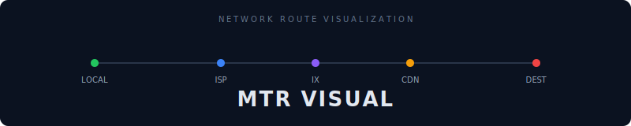
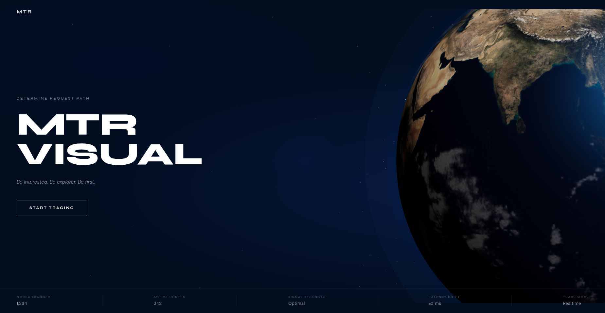
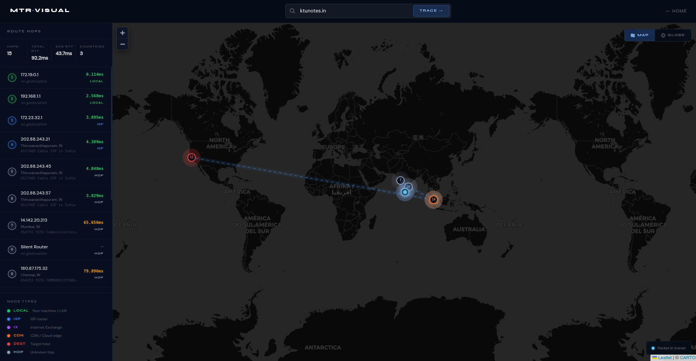
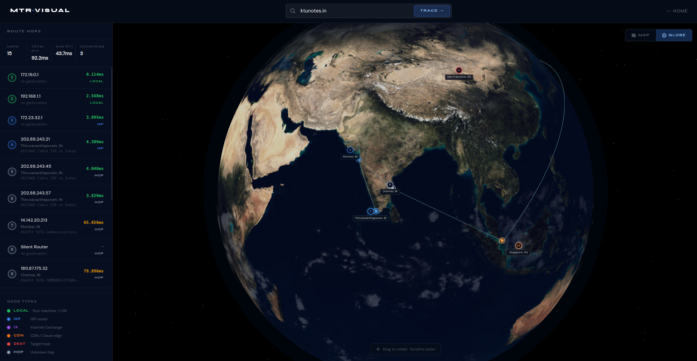

<div align="center">

<!-- Animated banner — commit assets/banner.svg to your repo, then this renders on GitHub -->


<br/>

<!-- Badges -->


<br/>

*Transform raw terminal traceroute output into a beautiful, animated, real-time route visualization across an interactive world map.*

</div>


## ✦ What is this?

When you type `traceroute google.com` in a terminal, you get a wall of IPs and milliseconds. **MTR Visualizer** takes that same data and turns it into something you can actually *see* — an animated packet traveling across a globe, hop by hop, country by country.

```
You  →  ISP Router  →  Internet Exchange  →  CDN Edge  →  google.com
 ●  ──────────●──────────────────●────────────────●─────────────●
```

Enter a domain. Watch the route unfold.


## ✦ Features

<table>
<tr>
<td width="50%">

**🗺️ Interactive Map**
Live Leaflet map with animated packet flow between every geo-located hop. Dashed route lines, pulsing node markers, smooth packet trail animation.

**🌐 3D Globe View**
Three.js rendered earth with hop markers pinned to exact coordinates. Great-circle arc paths, drag to rotate, scroll to zoom.

**📊 Hop Intelligence**
Each hop is auto-classified — LOCAL, ISP, CDN, IX, or DEST — with color coding, RTT latency coloring, org info, and city/country labels.

</td>
<td width="50%">

**⚡ Real-time MTR Tracing**
Uses MTR under the hood (not just `traceroute`) for richer, more accurate per-hop statistics.

**📍 IP Geolocation**
Every hop IP is geo-located to city, country, and org. Works out of the box; even better with an API key.

**🐳 One-Command Setup**
Fully Dockerized. `docker compose up --build` is the entire setup. No dependencies to install manually.

</td>
</tr>
</table>


## ✦ Screenshots

| Hero | Map View | Globe View |
|------|----------|------------|
|  |  |  |


## ✦ Quick Start

### 🐳 Docker (Recommended)

The only way to run MTR without root permission headaches. 

```bash
# 1. Clone
git clone https://github.com/Nazmin-Babubaker/mtrvisual.git
cd mtrvisual

# 2. Build & run
docker compose up --build

# 3. Open
# → http://localhost:3000
```


### 🔑 Better Geolocation (Optional)

The app works without this, but accuracy improves significantly with an API key.

```bash
# Get a free key at https://ipinfo.io (50k req/month free)

# Create the env file
echo "IPINFO_TOKEN=your_api_key_here" > backend/.env
```

Then rebuild:
```bash
docker compose up --build
```


### 📦 Without Docker

**Backend**
```bash
cd backend
npm install
node server.js
```

> ⚠️ `mtr` requires raw socket permissions. You may need `sudo` or `CAP_NET_RAW`.

**Frontend**
```bash
cd frontendnew
npm install
npm run dev
```
### ⚠️ OS Compatibility Notes
- ✅ Linux → Fully supported (recommended for development & production)
- ⚠️ macOS → Works, but may require manual mtr installation and permissions
- ❌ Windows (native) → Not supported (no native mtr)
- ✅ Windows (with WSL) → Fully supported (acts like Linux)

> 💡 If you're on Windows, use WSL or Docker to run the backend.

## ✦ Tech Stack

```
┌─────────────────────────────────────────────────────────┐
│                        FRONTEND                          │
│  Next.js  ·  React  ·  Leaflet  ·  Three.js (R3F)       │
├─────────────────────────────────────────────────────────┤
│                        BACKEND                           │
│  Node.js  ·  Express  ·  MTR  ·  IPInfo API             │
├─────────────────────────────────────────────────────────┤
│                        DEVOPS                            │
│  Docker  ·  Docker Compose  ·  NET_RAW capability        │
└─────────────────────────────────────────────────────────┘
```


## ✦ How It Works

```
  User types "google.com"
         │
         ▼
  ┌─────────────┐
  │  Validation  │  Client-side domain/IP check
  └──────┬──────┘
         │
         ▼
  ┌─────────────┐
  │  MTR Trace  │  Backend runs: mtr --json --report google.com
  └──────┬──────┘
         │  raw hops (IP + RTT)
         ▼
  ┌──────────────────┐
  │  IP Geolocation  │  IPInfo API → city, country, org, lat/lng
  └────────┬─────────┘
           │  enriched hops
           ▼
  ┌──────────────────┐
  │  Frontend Render │  Map + Globe + Sidebar + Packet animation
  └──────────────────┘
```


## ✦ Node Types

<table>
<tr>
<td><svg width="14" height="14" viewBox="0 0 14 14"><circle cx="7" cy="7" r="6" fill="#22c55e"/></svg></td><td><strong>LOCAL</strong></td><td>Your machine or LAN router</td>
</tr>
<tr>
<td><svg width="14" height="14" viewBox="0 0 14 14"><circle cx="7" cy="7" r="6" fill="#3b82f6"/></svg></td><td><strong>ISP</strong></td><td>Internet service provider hop</td>
</tr>
<tr>
<td><svg width="14" height="14" viewBox="0 0 14 14"><circle cx="7" cy="7" r="6" fill="#a855f7"/></svg></td><td><strong>IX</strong></td><td>Internet Exchange / peering point</td>
</tr>
<tr>
<td><svg width="14" height="14" viewBox="0 0 14 14"><circle cx="7" cy="7" r="6" fill="#f97316"/></svg></td><td><strong>CDN</strong></td><td>Cloudflare, Akamai, Fastly, AWS edge</td>
</tr>
<tr>
<td><svg width="14" height="14" viewBox="0 0 14 14"><circle cx="7" cy="7" r="6" fill="#ef4444"/></svg></td><td><strong>DEST</strong></td><td>Your target host</td>
</tr>
<tr>
<td><svg width="14" height="14" viewBox="0 0 14 14"><circle cx="7" cy="7" r="6" fill="#94a3b8"/></svg></td><td><strong>HOP</strong></td><td>Unknown / unclassified router</td>
</tr>
</table>


## ✦ Notes & Gotchas

| Issue | Cause | Fix |
|-------|-------|-----|
| `Permission denied` | MTR needs raw sockets | Use Docker (handles `NET_RAW`) |
| Hop shows `Silent Router` | ICMP filtered by that router | Expected — shown in sidebar |
| Inaccurate geo | No IPInfo key | Add `IPINFO_TOKEN` to `.env` |
| Globe markers off position | Lat/lng coordinate mismatch | Already fixed in current build |


## ✦ Author

Built as a full-stack deep-dive into:

- **System-level networking** — raw sockets, ICMP, TTL mechanics
- **Real-time data visualization** — Three.js, Leaflet, canvas animation
- **Modern web architecture** — Next.js App Router, Docker, REST APIs


<div align="center">

**If this project helped you or you found it interesting, drop a ⭐**

<br/>

*Made with curiosity about how the internet actually moves data.*

</div>
